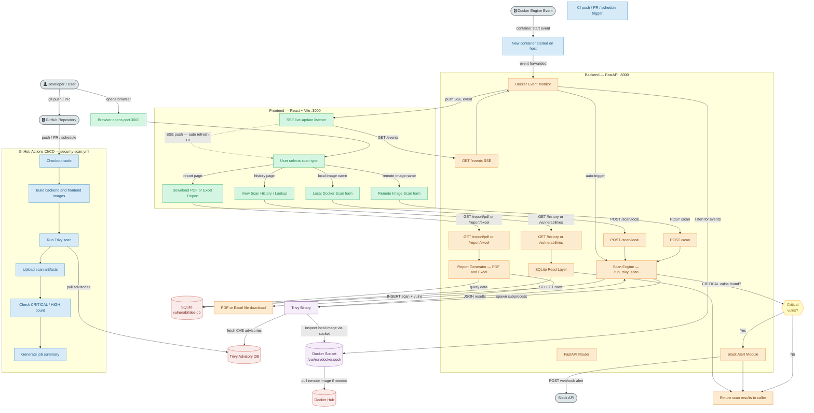

# System Flowchart

> Paste the code block below into [Mermaid Live Editor](https://mermaid.live) to render the diagram.

```mermaid
flowchart TD

    %% ── Trigger sources ──────────────────────────────────
    DEV(["fa:fa-user Developer / User"])
    GH_REPO(["fa:fa-github GitHub Repository"])
    DOCKER_EV(["fa:fa-docker Docker Engine Event"])

    %% ── Entry points ─────────────────────────────────────
    BROWSER["Browser opens port 3000"]
    CI_TRIGGER["CI push / PR / schedule trigger"]
    CONTAINER_START["New container started on host"]

    %% ── Frontend ─────────────────────────────────────────
    subgraph FE["Frontend — React + Vite  :3000"]
        FE_UI["User selects scan type"]
        FE_REMOTE["Remote Image Scan form"]
        FE_LOCAL["Local Docker Scan form"]
        FE_HISTORY["View Scan History / Lookup"]
        FE_REPORT["Download PDF or Excel Report"]
        FE_SSE["SSE live-update listener"]
    end

    %% ── Backend API ──────────────────────────────────────
    subgraph BE["Backend — FastAPI  :8000"]
        ROUTER["FastAPI Router"]
        EP_SCAN["POST /scan"]
        EP_LOCAL["POST /scan/local"]
        EP_HIST["GET /history or /vulnerabilities"]
        EP_REPORT["GET /report/pdf or /report/excel"]
        EP_EVENTS["GET /events  SSE"]

        SCAN_ENG["Scan Engine — run_trivy_scan"]
        REPORT_GEN["Report Generator — PDF and Excel"]
        DOCKER_MON["Docker Event Monitor"]
        DB_READ["SQLite Read Layer"]
        SLACK_MOD["Slack Alert Module"]
    end

    %% ── Host tools ───────────────────────────────────────
    TRIVY["Trivy Binary"]
    DOCKER_SOCK[("Docker Socket\n/var/run/docker.sock")]
    TRIVYDB[("Trivy Advisory DB")]
    DOCKERHUB[("Docker Hub")]

    %% ── Persistence ──────────────────────────────────────
    SQLITE[("SQLite\nvulnerabilities.db")]

    %% ── External services ────────────────────────────────
    SLACK(["Slack API"])

    %% ── CI/CD path ───────────────────────────────────────
    subgraph CICD["GitHub Actions CI/CD — security-scan.yml"]
        CI_CHECKOUT["Checkout code"]
        CI_BUILD["Build backend and frontend images"]
        CI_SCAN["Run Trivy scan"]
        CI_UPLOAD["Upload scan artifacts"]
        CI_CHECK["Check CRITICAL / HIGH count"]
        CI_SUMMARY["Generate job summary"]
    end

    %% ═════════════════════════════════════════════════════
    %% FLOW
    %% ═════════════════════════════════════════════════════

    %% Trigger → entry
    DEV -->|"opens browser"| BROWSER
    DEV -->|"git push / PR"| GH_REPO
    DOCKER_EV -->|"container start event"| CONTAINER_START

    %% Browser → Frontend
    BROWSER --> FE_UI
    FE_UI -->|"remote image name"| FE_REMOTE
    FE_UI -->|"local image name"| FE_LOCAL
    FE_UI -->|"history page"| FE_HISTORY
    FE_UI -->|"report page"| FE_REPORT
    FE_SSE -.->|"SSE push — auto refresh UI"| FE_UI

    %% Frontend → Backend
    FE_REMOTE -->|"POST /scan"| EP_SCAN
    FE_LOCAL  -->|"POST /scan/local"| EP_LOCAL
    FE_HISTORY -->|"GET /history or /vulnerabilities"| EP_HIST
    FE_REPORT  -->|"GET /report/pdf or /report/excel"| EP_REPORT
    FE_SSE     -->|"GET /events"| EP_EVENTS

    %% Backend routing
    EP_SCAN   --> SCAN_ENG
    EP_LOCAL  --> SCAN_ENG
    EP_HIST   --> DB_READ
    EP_REPORT --> REPORT_GEN
    EP_EVENTS --> DOCKER_MON

    %% Scan Engine execution
    SCAN_ENG -->|"spawn subprocess"| TRIVY
    TRIVY -->|"inspect local image via socket"| DOCKER_SOCK
    DOCKER_SOCK -->|"pull remote image if needed"| DOCKERHUB
    TRIVY -->|"fetch CVE advisories"| TRIVYDB

    %% Scan result handling
    TRIVY -->|"JSON results"| SCAN_ENG
    SCAN_ENG -->|"INSERT scan + vulns"| SQLITE
    SCAN_ENG -->|"CRITICAL vulns found?"| CRITICAL{{"Critical\nvulns?"}}
    CRITICAL -->|"Yes"| SLACK_MOD
    CRITICAL -->|"No"| RESP_OK["Return scan results to caller"]
    SLACK_MOD -->|"POST webhook alert"| SLACK
    SLACK_MOD --> RESP_OK

    %% Read path
    DB_READ -->|"SELECT rows"| SQLITE
    DB_READ --> RESP_OK

    %% Report generation
    REPORT_GEN -->|"query data"| SQLITE
    REPORT_GEN --> FILE["PDF or Excel file download"]

    %% Docker Monitor / SSE auto-scan
    CONTAINER_START -->|"event forwarded"| DOCKER_MON
    DOCKER_MON -->|"listen for events"| DOCKER_SOCK
    DOCKER_MON -->|"auto-trigger"| SCAN_ENG
    DOCKER_MON -->|"push SSE event"| FE_SSE

    %% CI/CD path
    GH_REPO -->|"push / PR / schedule"| CI_CHECKOUT
    CI_CHECKOUT --> CI_BUILD
    CI_BUILD --> CI_SCAN
    CI_SCAN -->|"pull advisories"| TRIVYDB
    CI_SCAN --> CI_UPLOAD
    CI_UPLOAD --> CI_CHECK
    CI_CHECK --> CI_SUMMARY

    %% ═════════════════════════════════════════════════════
    %% STYLES
    %% ═════════════════════════════════════════════════════
    classDef actor    fill:#dfe6e9,stroke:#636e72,color:#2d3436
    classDef fe       fill:#d5f5e3,stroke:#27ae60,color:#1e8449
    classDef be       fill:#fdebd0,stroke:#e67e22,color:#784212
    classDef cicd     fill:#d6eaf8,stroke:#2980b9,color:#1a5276
    classDef db       fill:#f9ebea,stroke:#c0392b,color:#7b241c
    classDef host     fill:#f5eef8,stroke:#8e44ad,color:#4a235a
    classDef decision fill:#fff9c4,stroke:#f39c12,color:#7d6608

    class DEV,GH_REPO,DOCKER_EV,SLACK actor
    class BROWSER,FE_UI,FE_REMOTE,FE_LOCAL,FE_HISTORY,FE_REPORT,FE_SSE fe
    class ROUTER,EP_SCAN,EP_LOCAL,EP_HIST,EP_REPORT,EP_EVENTS,SCAN_ENG,REPORT_GEN,DOCKER_MON,DB_READ,SLACK_MOD,RESP_OK,FILE be
    class CI_CHECKOUT,CI_BUILD,CI_SCAN,CI_UPLOAD,CI_CHECK,CI_SUMMARY,CI_TRIGGER,CONTAINER_START cicd
    class SQLITE,TRIVYDB,DOCKERHUB db
    class TRIVY,DOCKER_SOCK host
    class CRITICAL decision
```
