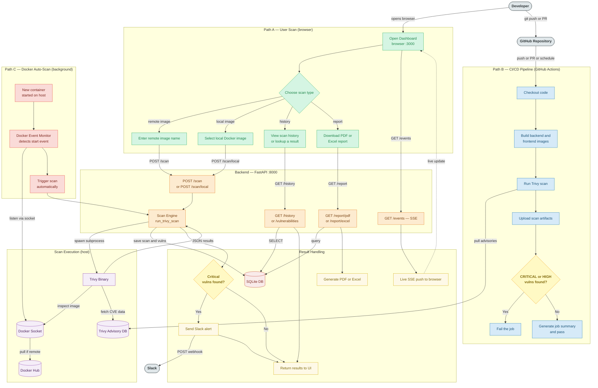

# Flowchart — CI/CD Pipeline Exposure Management System

## How to import into lucid.app

1. Open **lucid.app** → **New Document → Lucidchart**
2. Click **Insert → More shapes → Mermaid** (or paste via **File → Import**)
3. Paste the code block below and click **Generate**

---

---

## Colour key

| Colour | Layer |
|--------|-------|
| 🟢 Green | Frontend (React, browser) |
| 🟠 Orange | Backend (FastAPI) |
| 🟣 Purple | Scan execution (Trivy, Docker socket) |
| 🔴 Red | Database (SQLite) |
| 🔵 Blue | CI/CD (GitHub Actions) |
| 🩷 Pink | Auto-scan (Docker Event Monitor) |
| 🟡 Yellow | Decision nodes |
| ⚪ Grey | External actors / services |
